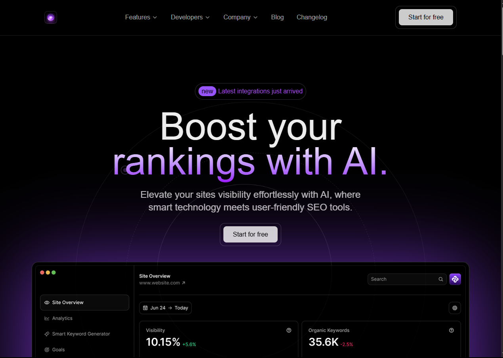

# 🚀 AI Startup Landing Page

A modern, high-performance landing page for AI startups built with **Next.js 14** and **GSAP animations**. Features smooth interactions, responsive design, and optimal performance for converting visitors into customers.



## ✨ Live Demo

[**🌐 View Live Website**](https://ai-starup.netlify.app/)

## 📹 Video Demo

[**🎥 Watch Video Demo**](https://www.linkedin.com/feed/update/urn:li:activity:7389730075354628098/) <!-- Link to your LinkedIn post -->

## 🛠️ Tech Stack

- **Framework:** [Next.js 14](https://nextjs.org/) (App Router)
- **Animations:** [GSAP](https://greensock.com/gsap/) 
- **Styling:** [Tailwind CSS](https://tailwindcss.com/)
- **Language:** [TypeScript](https://www.typescriptlang.org/)
- **Deployment:** [Netlify](https://www.netlify.com/)
- **Icons:** [Lucide React](https://lucide.dev/)
- **Fonts:** Google Fonts (Inter)

## 🎯 Key Features

- ⚡ **Blazing Fast** - Built with Next.js 14 for optimal performance
- 🎬 **Smooth Animations** - GSAP-powered scroll-triggered animations
- 📱 **Fully Responsive** - Perfect on all devices and screen sizes
- 🎨 **Modern Design** - Clean, professional AI startup aesthetic
- 🔍 **SEO Optimized** - Proper meta tags and semantic HTML
- ♿ **Accessible** - WCAG guidelines compliance
- 🚀 **Easy to Customize** - Well-structured and documented code


## 🚀 Quick Start

### Prerequisites
- Node.js 18.17 or later
- npm, yarn, pnpm, or bun

### Installation

1. **Clone the repository**
```bash
git clone https://github.com/hey-Zayn/AI-Business-Wesbite-Next.js.git
cd ai-startup-landing


